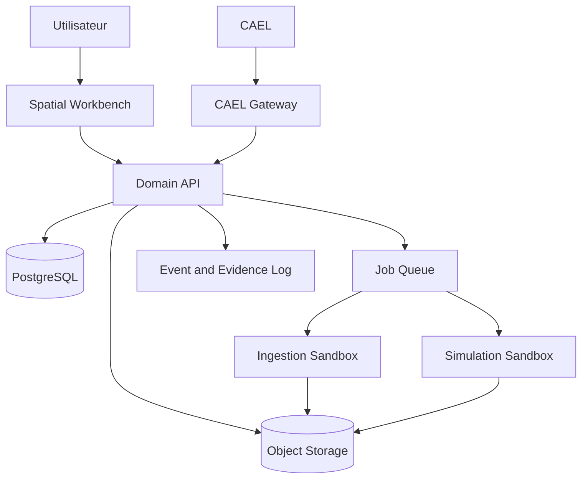
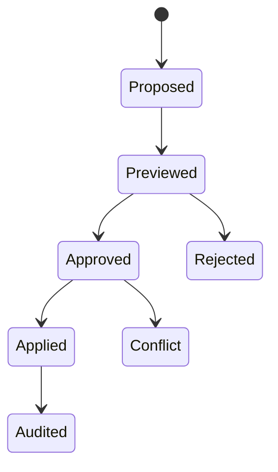

# Architecture de KOREV Labs 3D

## 1. Vision

KOREV Labs 3D est un environnement spatial de recherche et d'ingénierie. Il transforme des sources hétérogènes - PDF, code, jeux de données, images techniques et meshes - en une scène 3D sémantique que l'utilisateur peut explorer, annoter, simuler et modifier avec CAEL.

La promesse centrale n'est pas de produire automatiquement une vérité physique. Le système rend visibles trois catégories qui ne doivent jamais être confondues :

1. ce qui est **extrait** d'une source ;
2. ce qui est **calculé** par un moteur déterminé ;
3. ce qui est **inféré** ou supposé pour compléter le modèle.

Un objet 3D sans provenance ou sans niveau de confiance est considéré comme invalide.

## 2. Principes non négociables

- **Application autonome** : KOREV Labs 3D reste utilisable sans CAEL.
- **CAEL sans accès générique** : CAEL soumet des intentions typées, jamais du code ou des commandes shell.
- **Révisions immuables** : une modification crée une nouvelle révision ; elle n'écrase pas l'état précédent.
- **Prévisualisation avant mutation** : toute écriture issue de CAEL produit d'abord un patch inspectable.
- **Optimistic locking** : un patch ne s'applique qu'à la révision exacte sur laquelle il a été proposé.
- **Provenance par construction** : objets, paramètres, simulations et exports pointent vers leurs sources.
- **Unités explicites** : aucune valeur physique sans unité ni repère.
- **Calcul isolé** : parsing, conversion et simulation s'exécutent dans des workers bornés.
- **Niveaux de vérité visibles** : conceptual, parametric et calibrated sont affichés dans l'interface.
- **Confidentialité par défaut** : aucun contenu privé n'est envoyé à un fournisseur de modèle sans politique explicite.

## 3. Vue globale



### Frontière de confiance

Le navigateur et CAEL sont deux clients distincts de la Domain API. Le navigateur possède des capacités interactives liées à l'identité humaine. CAEL passe par un gateway dédié qui traduit ses appels en commandes de domaine autorisées et lui refuse l'accès direct au stockage, aux workers et aux fichiers.

## 4. Composants

### 4.1 Spatial Workbench

Application React/TypeScript composée de cinq espaces :

- **Viewport 3D** : scène, sélection, gizmos, couches, matériaux et annotations.
- **Scene Graph** : hiérarchie sémantique des objets et recherche.
- **Algorithm Graph** : nœuds de calcul, ports typés, flux et paramètres.
- **Timeline** : replay des signaux, événements, simulations et décisions.
- **Inspector** : propriétés, unités, provenance, confiance, hypothèses et différences de révision.

Le format d'affichage privilégié est glTF/GLB. Les formats lourds ou métier sont convertis côté worker puis liés à leur source originale.

### 4.2 Domain API

FastAPI porte les invariants métier :

- projets, membres et niveaux de confidentialité ;
- sources et résultats d'analyse ;
- scènes et révisions ;
- patch proposals et approbations ;
- expériences, campagnes et runs ;
- artefacts, exports et provenance ;
- quotas, idempotence et journal d'événements.

L'API ne lance aucun binaire de conversion dans son propre processus.

### 4.3 Ingestion Sandbox

Pipeline prévu :

1. mise en quarantaine et calcul du SHA-256 ;
2. validation MIME par contenu, pas seulement par extension ;
3. antivirus et détection d'archives récursives ;
4. extraction spécialisée ;
5. normalisation vers la Spatial Knowledge IR ;
6. génération d'une scène brouillon ;
7. rapport des ambiguïtés et informations manquantes.

Adaptateurs :

- PDF : texte, figures, tableaux, équations, dimensions et citations de pages ;
- code : AST, dépendances, paramètres, entrées/sorties et environnement déclaré ;
- mesh : topologie, unités, manifold, normales, matériaux et enveloppe ;
- données : schéma, unités, temps, repères et statistiques descriptives ;
- CAO : conversion STEP/IGES vers représentation d'affichage sans perdre l'original.

### 4.4 Spatial Knowledge IR

La SKIR est le contrat canonique entre ingestion, interface et simulation. Elle est versionnée indépendamment des formats d'entrée.

Entités principales :

```text
Project
  SceneRevision
    CoordinateFrame
    SceneObject
      GeometryRef
      MaterialRef
      Transform
      SemanticProperties
      SourceReference[]
      Assumption[]
    AlgorithmGraph
      AlgorithmNode[]
      TypedEdge[]
    ParameterSet
    ValidationFinding[]
```

Chaque `SourceReference` contient au minimum : hash du document, emplacement interne (page, ligne, plage de données), méthode d'extraction et confiance.

### 4.5 Simulation Sandbox

Les moteurs de simulation sont des plugins versionnés. Un plugin déclare :

- types d'entrées et unités ;
- version du moteur et image de conteneur ;
- déterminisme attendu et graine ;
- ressources maximales ;
- sorties et métriques ;
- validations de préconditions.

Les premiers plugins prévus sont : animation analytique légère, propagation sur membrane, import de résultats externes, campagnes Monte-Carlo et comparaison A/B.

### 4.6 CAEL Gateway

Le connecteur expose une surface étroite :

```text
create_spatial_project
register_source_metadata
get_scene_summary
propose_scene_patch
get_patch_preview
run_bounded_experiment
compare_experiment_runs
list_project_artifacts
export_approved_artifact
```

Il n'expose jamais `execute_code`, `run_shell`, `read_path` ou une URL réseau arbitraire.

Un appel CAEL porte : utilisateur authentifié, projet, action, payload validé, révision de base, budget, clé d'idempotence et identifiant de mission. Les décisions sont prises côté serveur par la politique de KOREV Labs 3D ; une instruction textuelle du modèle n'accorde aucun droit.

## 5. Modèle de modification

Une modification suit toujours ce cycle :



Une proposition contient des opérations allowlistées : ajout d'objet, suppression logique, transformation, mise à jour d'une propriété ou liaison de provenance. L'application vérifie à nouveau les droits, le schéma, les unités et la révision au moment exact de l'écriture.

## 6. Données et stockage cible

- PostgreSQL : métadonnées, scènes, révisions, graphes, politiques et événements.
- stockage S3 compatible : sources, meshes, textures, datasets et exports.
- Redis ou équivalent : file de jobs et verrous courts.
- Parquet/Arrow : séries et résultats scientifiques volumineux.
- glTF/GLB : livraison web des scènes.

Les blobs sont adressés par contenu. Une base de données ne conserve jamais un chemin local arbitraire fourni par un client.

## 7. API cible

```text
POST   /v1/projects
GET    /v1/projects/{project_id}
POST   /v1/projects/{project_id}/sources
POST   /v1/projects/{project_id}/ingestion-jobs
GET    /v1/jobs/{job_id}
GET    /v1/projects/{project_id}/scene
POST   /v1/projects/{project_id}/patches/preview
POST   /v1/projects/{project_id}/patches/{patch_id}/apply
POST   /v1/projects/{project_id}/experiments
POST   /v1/experiments/{experiment_id}/runs
GET    /v1/runs/{run_id}/artifacts
```

La verticale actuelle implémente projets persistants, sources PDF/Python/OBJ/GLB, spatialisation, scènes et cycle preview/apply avec verrou de révision. Les parseurs s'exécutent encore dans le service API de développement ; leur déplacement vers les sandboxes rootless reste un blocage explicite de production.

## 8. Observabilité et audit

Chaque événement métier comporte :

- acteur humain ou service ;
- organisation et projet ;
- horodatage serveur ;
- révision avant/après ;
- hash du payload ;
- action de politique et décision ;
- résultat ou erreur stable ;
- version des moteurs employés ;
- corrélation mission CAEL / expérience / artefact.

L'intégration future à Evidence ajoutera scellement cryptographique et attestations. L'application conserve dès V0 des structures compatibles sans prétendre fournir cette garantie avant son raccordement réel.

## 9. Déploiement

Les environnements sont séparés : local, staging confidentiel et production. En production :

- API et gateway sans privilège ;
- workers éphémères, rootless et sans réseau par défaut ;
- buckets séparés entre quarantaine et artefacts validés ;
- clés de chiffrement gérées hors du code ;
- secrets courts et rotation ;
- sauvegardes chiffrées et tests de restauration ;
- suppression vérifiable selon la politique de rétention.

## 10. Critères d'architecture terminée

L'architecture sera considérée opérationnelle lorsque :

- une source non fiable ne peut pas atteindre directement un moteur privilégié ;
- chaque objet affiché expose provenance et niveau de maturité ;
- une commande CAEL ne peut produire qu'un patch typé et révisable ;
- deux utilisateurs ne peuvent pas appliquer silencieusement des patches concurrents ;
- une expérience est reproductible à partir de ses artefacts et versions ;
- l'utilisateur peut revenir à toute révision sans perte d'audit ;
- les tests hostiles couvrent permissions, quotas, formats, unités et conflits.
